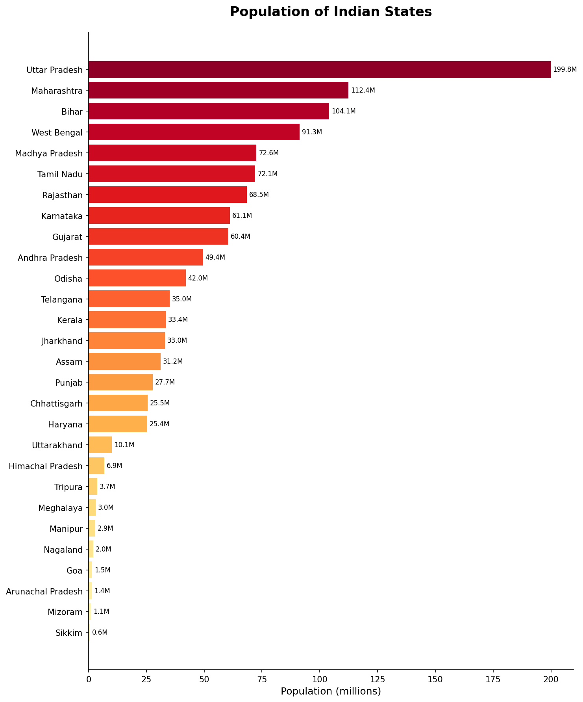
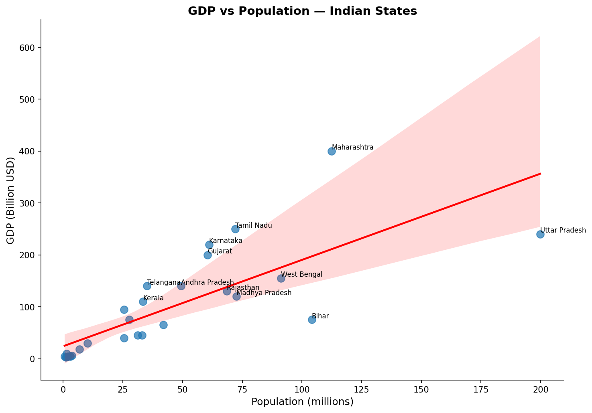
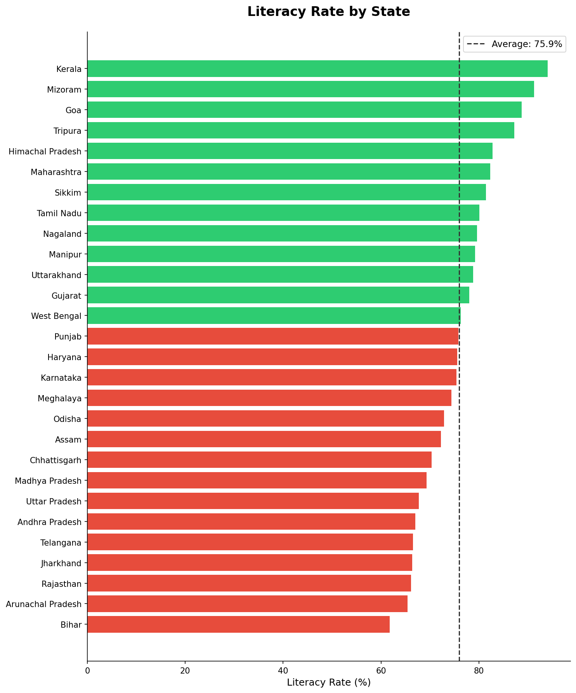
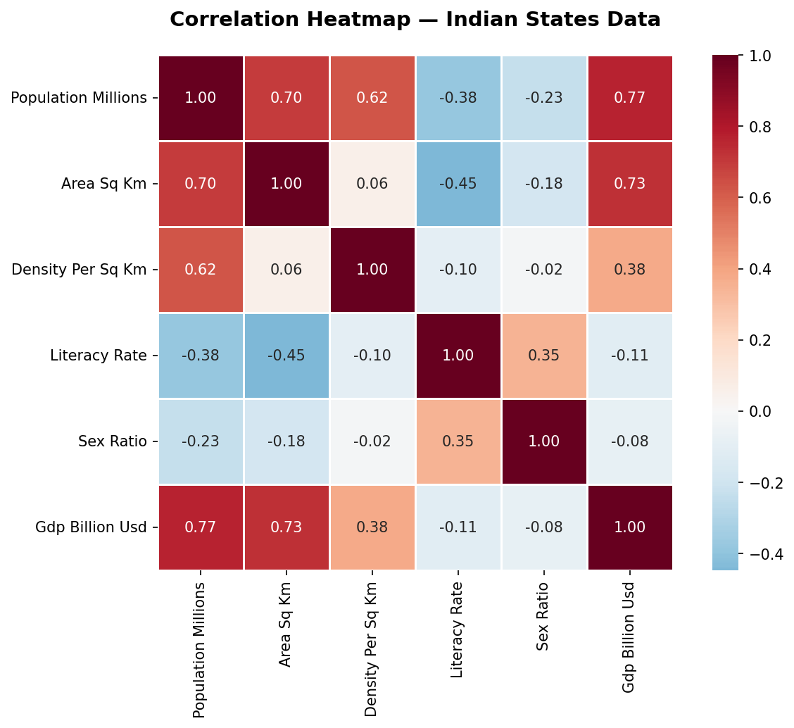

# 🇮🇳 India States Data Visualization

An exploratory data analysis of Indian states — population, literacy, GDP, and demographics — using Python, pandas, matplotlib, and seaborn.

## Dataset

The dataset covers 28 Indian states with the following attributes:

| Column | Description |
|--------|-------------|
| population_millions | Population in millions |
| area_sq_km | Geographic area in square kilometers |
| density_per_sq_km | Population density |
| literacy_rate | Literacy rate (%) |
| sex_ratio | Females per 1000 males |
| gdp_billion_usd | State GDP in billion USD |
| region | Geographic region (North/South/East/West/Central/Northeast) |

## Visualizations

### Population Distribution


### GDP vs Population


### Literacy Rate by State


### Correlation Heatmap


See all 13 charts in the [plots/](plots/) folder.

## Setup

```bash
pip install pandas matplotlib seaborn
python src/analyze.py
```

## Project Structure

```
india-data-viz/
├── data/
│   └── india_states.csv
├── plots/
│   └── (generated charts)
├── src/
│   ├── analyze.py
│   ├── plot_population.py
│   ├── plot_literacy.py
│   ├── plot_gdp.py
│   ├── plot_density.py
│   ├── plot_sex_ratio.py
│   └── plot_regional.py
├── .gitignore
├── requirements.txt
└── README.md
```
## Technologies

- Python 3.11
- pandas for data manipulation
- matplotlib and seaborn for visualization
- SQLite for database analysis
- SQL for querying and aggregation

## License

MIT

## Author

Vaishnav Venkatesh - [GitHub](https://github.com/Vaishnav0777)

## Status

 

## License

MIT License. See [LICENSE](LICENSE) for details.
